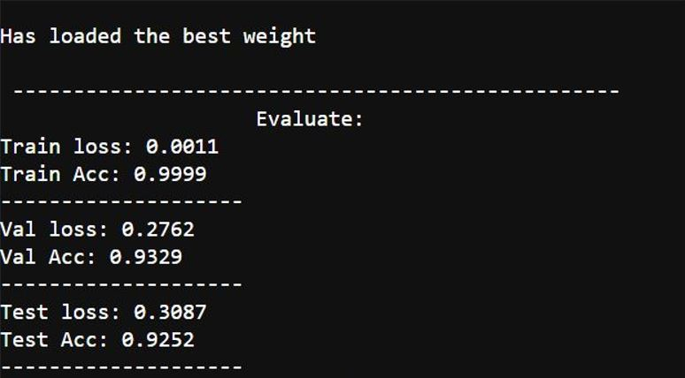

# Update
- __[2021/09/24]__
  * Change the initial learning rate to higher value (0.1)
  * Change the step-down factor of lr rate to higher value (0.7)  
  * According to the experimental result, it is better for ExquisiteNetV2.

# Requirements
- [Pytorch >= 1.8.0](https://pytorch.org/)
- Tensorboard
  ```
  pip install tensorboard
  ```

# Train Cifar-10
The best weight has been in the directory `weight/exp`.

If you want to reproduce the result, you can follow the precedure below.
- __Download the cifar-10 from [official website](https://www.cs.toronto.edu/~kriz/cifar.html)__
  1. Download python version and unzip it.
  2. Put `split.py` into the directory `cifar-10-python`  
     then type:
     ```
     python split.py
     ```  
     Now you get the cifar10 raw image in the directory `cifar10`
     
- __Train from scratch__
  ```
  python train.py --data cifar10 --end_lr 0.001 --seed 21 --val_r 0.2
  ```

- __Tensorboard__  
  My code will tell you the log path.
  ```
  tensorboard --logdir={tensorboard log path}
  ```

- __Result__  
  After training stop, You will get this result.
  
  
# Evaluation
```
python eval.py --data cifar10/test --weight md.pt
```

# Combined with yolov5
Read `guide.pptx`  
Please download [yolov5](https://github.com/ultralytics/yolov5) first.  
`my.yaml` is the architecture of ExquisiteNetV2-Yolov5. 

# Combined with Mask/Faster-RCNN
Defined in the `ExquisiteNetV2_Mask_RCNN.py`.  

# Citation
[https://arxiv.org/abs/2105.09008](https://arxiv.org/abs/2105.09008)


If my code has defect or there is better algorithm, welcome to contact me :)
